# Note Sphere

[](https://events.withgoogle.com/build-with-ai/)
[](https://developers.generativeai.google/)
[](https://developers.google.com)
[](https://cloud.google.com)
[](https://mlh.io)

Note Sphere is an AI-native study and collaboration platform designed to help students turn scattered notes, documents, and routines into structured knowledge. It combines multimodal note processing, an AI study companion, knowledge graph exploration, semester planning, task management, and sharing tools in one workspace.

This project was built for Build With AI Hack Days @DIU, a fast-paced in-person mini hackathon powered by Google for Developers, Gemini, and .XYZ, organized by Machine Learning Bangladesh with support from Major League Hacking (MLH), in collaboration with the Department of Information Technology & Management (ITM), Daffodil International University.

Note Sphere was one of the winners at the event and received Google Swag Kits.

## What It Does

- Upload notes, images, PDFs, and other study material for AI-assisted processing.
- Chat with your notes to extract answers, summaries, and study guidance.
- Generate preparation summaries, quizzes, and high-yield review content.
- Organize semesters, tasks, and study plans in a single dashboard.
- Explore relationships between notes with a knowledge graph view.
- Share notes and collaborate in dedicated rooms.
- Use the Holmes Scanner for quick, detective-style academic scanning workflows.

## Tech Stack

- React 19 + TypeScript
- Vite
- Express server with Gemini API integration
- Tailwind CSS v4
- Motion, Lucide, D3 force graph, react-dropzone, and jsPDF

## Repository Safety

- Secrets are kept out of the repository through `.gitignore`, including `.env` files and build outputs.
- Generated artifacts such as `dist/`, `build/`, and `node_modules/` are ignored.
- A sample environment file is included as [.env.example](.env.example).

## Getting Started

### Prerequisites

- Node.js 18 or newer
- A Gemini API key

### Install

```bash
npm install
```

### Environment Variables

Create a local environment file and add your key:

```bash
GEMINI_API_KEY=your_gemini_api_key_here
```

You can use [.env.example](.env.example) as the starting point.

### Run Locally

```bash
npm run dev
```

### Build for Production

```bash
npm run build
```

### Start the Production Server

```bash
npm run start
```

### Type Check

```bash
npm run lint
```

## Project Structure

- `src/` contains the React application and UI components.
- `server.ts` hosts the Gemini-powered API endpoints.
- `index.html` sets the browser tab title and app shell.

## Screenshots

Below are representative screens from Note Sphere. Click any image to view the full-resolution version in the repository.

- Dashboard

	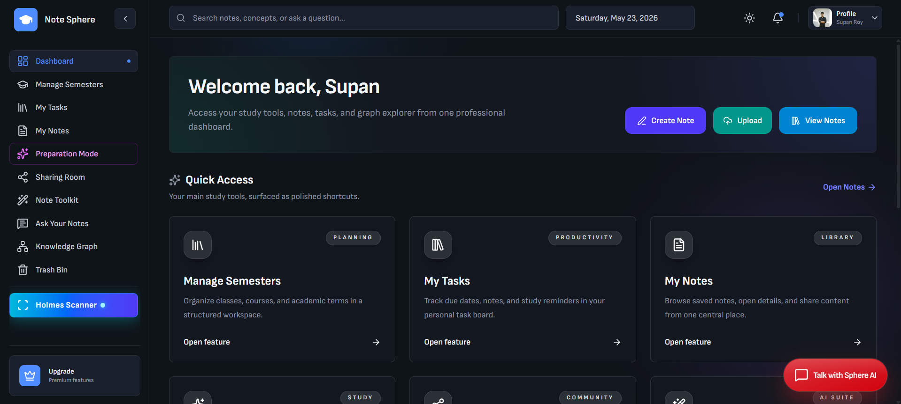

- Create Note

	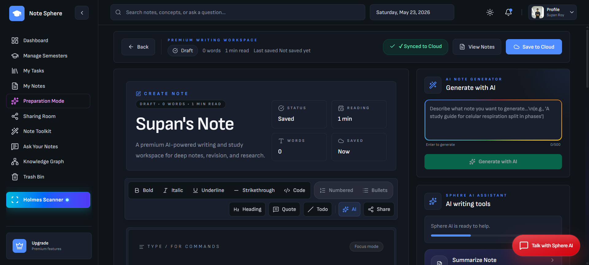

- Semester Management

	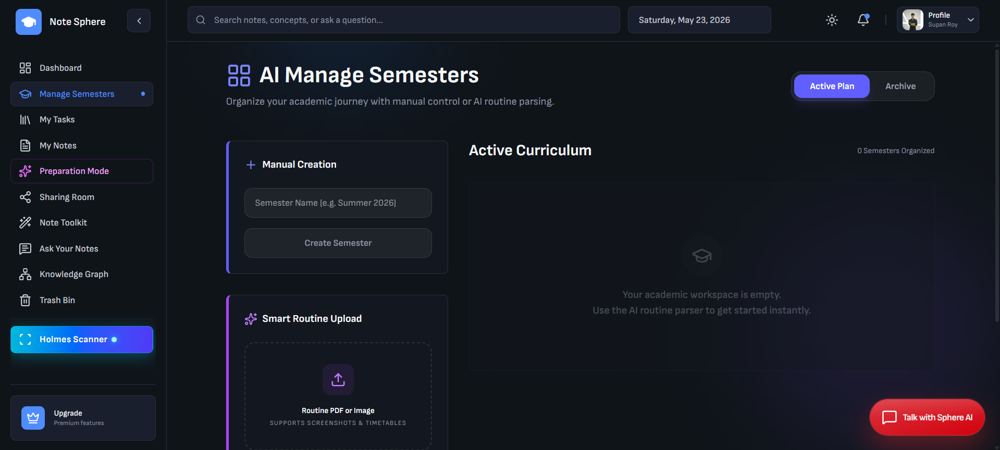

- Tasks Manager

	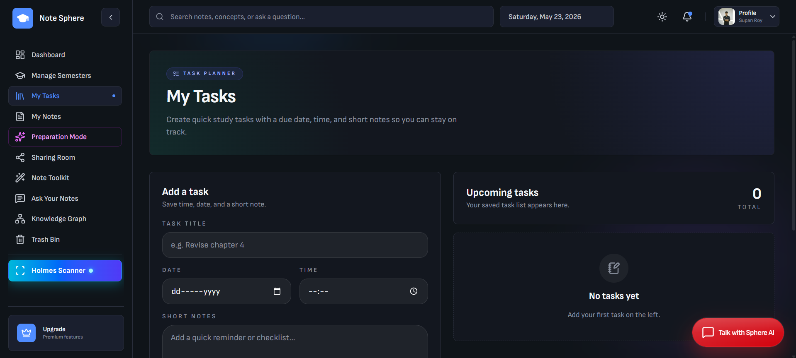

- My Notes

	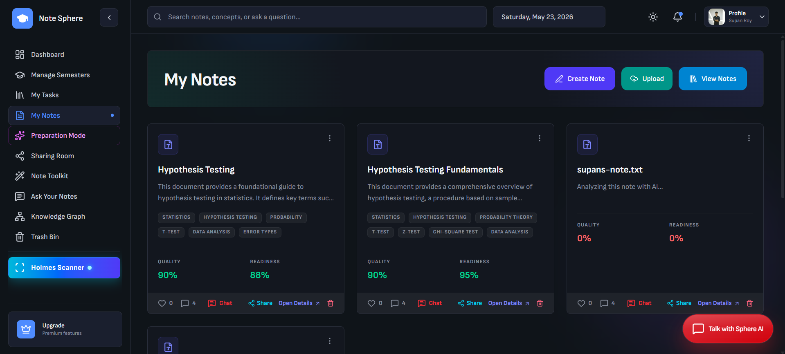

- Preparation Mode

	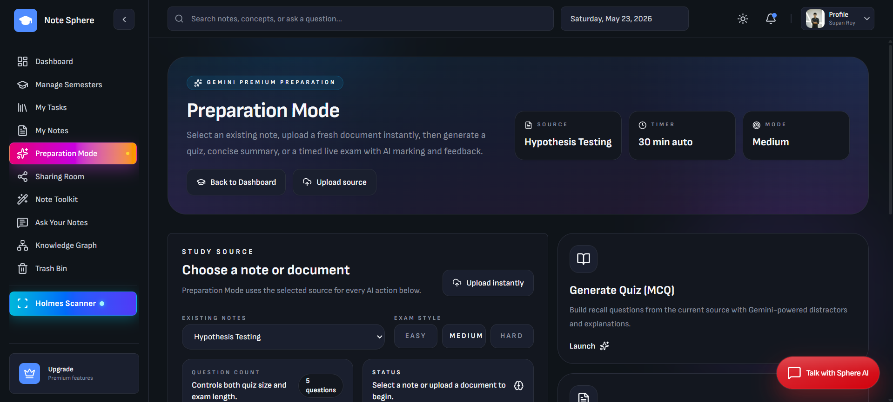

- Sharing Room

	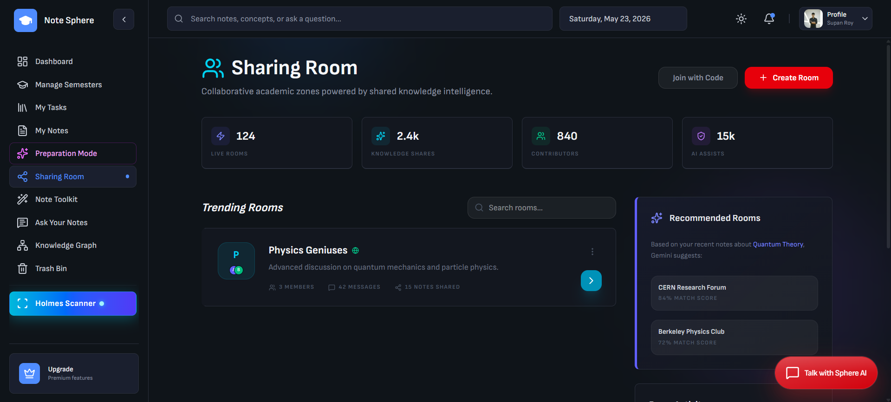

- AI Study Toolkit

	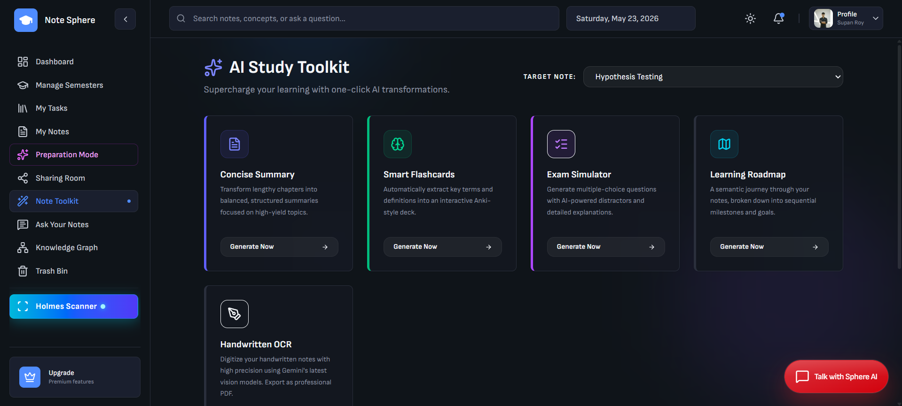

- Ask Your Notes

	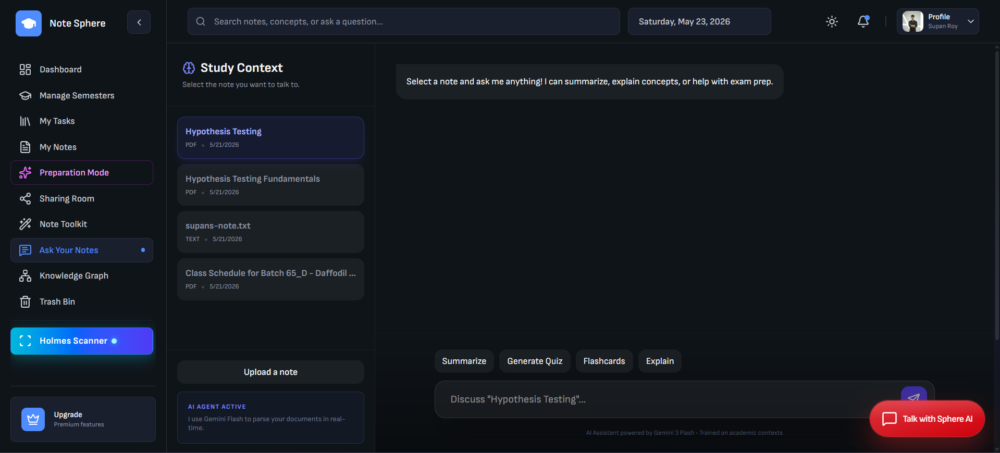

- Knowledge Graph

	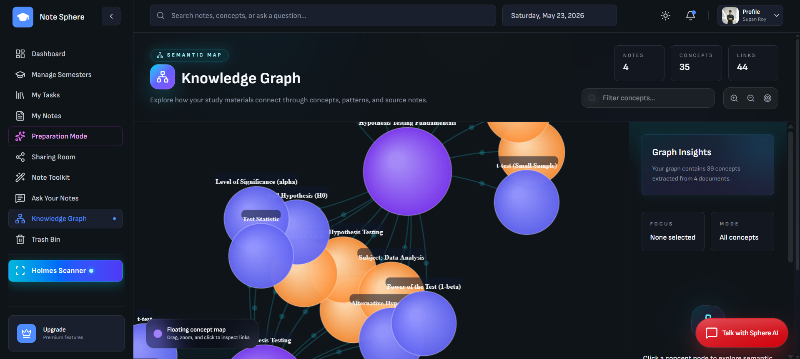

- Trash Bin

	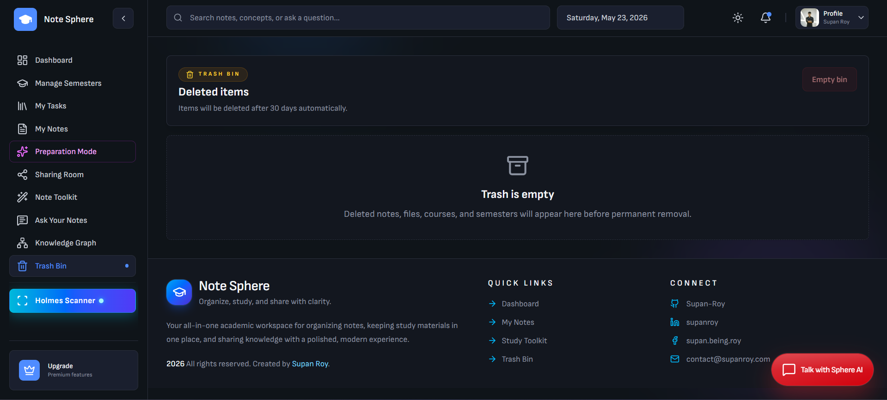

- Holmes Scanner

	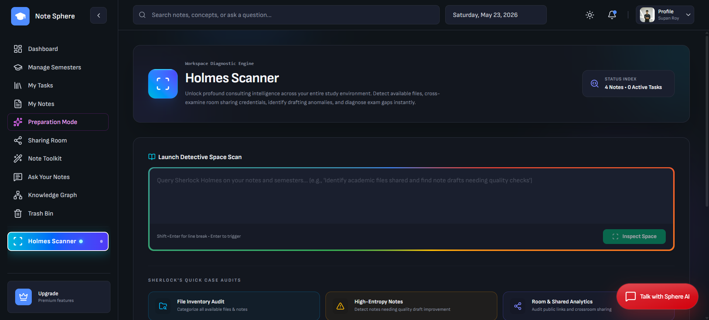


## Developed By

Supan Roy

contact@supanroy.com

## License

This project is released under the MIT License — see the [LICENSE](LICENSE) file for details.
